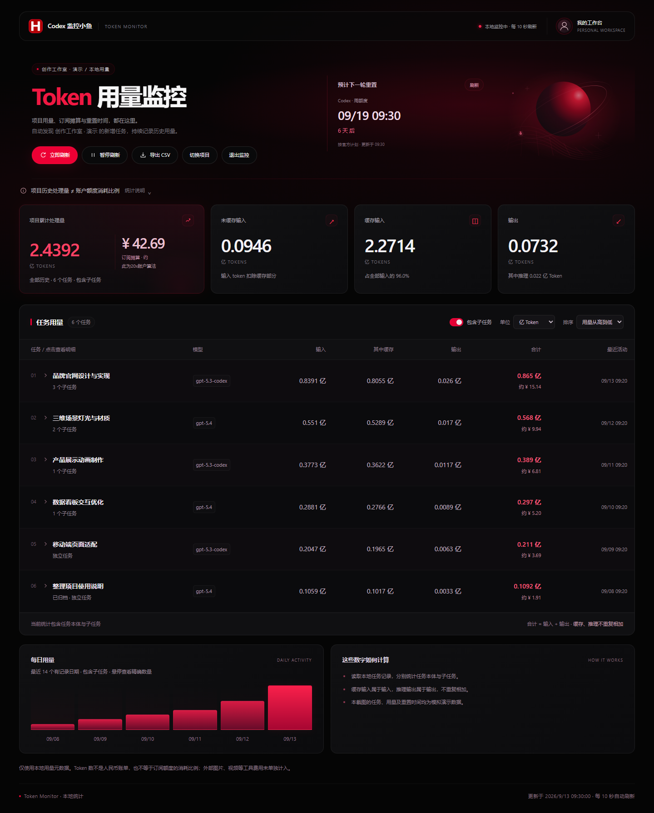

# Blender 开工助手 · Blender Beginner

**New to 3D? Describe your idea. Codex helps set up Blender, build an editable project, track tokens, and show render progress.**

[简体中文](README.md) · [Quick start](docs/quickstart.md) · [Projects and source files](#projects-source-files-and-condensed-conversations) · [Usage and progress](docs/usage-progress.md)

A Blender skill for Codex, currently **v05 / Early Preview**. Once enabled, start with one of these requests.

## Where it can help

**Start from zero | “I've never used Blender. Install it on D and keep my projects there too.”**

→ Get Blender installed, its Chinese interface and autosave configured, project and render folders created, and a starter file that opens and renders.

**Make a reference editable | “Use this reference to make a 3D project I can keep editing.”**

→ Get a breakdown of shapes, materials and lighting, with the difficult parts and expected differences explained. Review a small preview, refine it, and receive the editable `.blend` and rendered image.

**Record token usage | “Start recording the tokens this conversation uses for this project from now on.”**

→ Get a recording baseline and an updated usage record showing the observed total, cutoff time and pending usage.

**Watch render progress | “Start rendering and show the progress and estimated time remaining.”**

→ Get a local page with the current stage, elapsed time and completed frames. Once enough full frames are available, it updates an estimated remaining-time range.

**Test your computer | “Can this computer handle 4K or animation? Test it with this project.”**

→ Get GPU, VRAM and RAM details, an acceleration check, measured sample-render time, and settings recommendations for your computer.

**[Try it →](docs/quickstart.md)**

<details>
<summary>More examples: reference scores, materials, targeted revisions, and editable delivery</summary>

| What you need | Say this, and the skill gets to work |
| --- | --- |
| Install Blender and organize the files | Say **“Install Blender on my D drive and put my projects there too”** → Downloads and installs Blender, configures the Chinese interface and autosave, creates project and render folders, and delivers a starter file that opens and renders. |
| Find out whether this computer can handle 4K or animation | Say **“Test this project on my computer and tell me whether to aim for a 4K still or an animation”** → Detects the GPU, VRAM and RAM, checks GPU acceleration, and runs a time-limited sample; delivers measured render time, GPU availability and verification results, and separate settings recommendations and remaining checks for 4K and animation. |
| Understand what is achievable from a reference | Say **“Score this reference and tell me the difficult parts and expected differences”** → Delivers an evidence-based 0–100 assessment of the approach, covering shape, materials, lighting and camera, assets, and device limits, with the hardest assumptions to test first. |
| Describe a look without learning nodes | Say **“Make this sphere frosted glass, add a glow around the edges, and soften the background”** → Builds the material nodes, glow and depth-of-field settings, then delivers an editable project and a preview. |
| Refine a result | Say **“The wood grooves are too shiny. Change only that and keep everything else”** → Adjusts the relevant effect in the current project, saves a new version and comparison previews, and checks the objects, materials and composition you wanted to preserve. |
| Get source files you can keep editing | Say **“Give me the editable project, its assets, and a preview”** → Delivers the `.blend`, required assets and production scripts; reopens the saved project, checks dependencies, renders a preview and inspects the image. |
| Track a project's token usage | Say **“Start recording the tokens this conversation uses for this project from now on”** → Establishes a baseline and produces an updated usage record with the observed total, cutoff time and pending usage, available to check as work continues. |
| See render progress and remaining time | Say **“Start rendering and show me the progress and time remaining”** → Opens a local page for this render with its stage, elapsed time and completed frames; once enough full frames are available, updates an estimated remaining-time range. |

You describe the result and review previews; Codex does the work. Automatic installation currently targets Windows, Mac execution still needs real-device validation, scores are not reconstruction percentages, usage covers the specified conversation's recorded interval, and remaining time is estimated from complete frames in the render launched by the skill. See the [quick start](docs/quickstart.md) and [usage and progress details](docs/usage-progress.md).

</details>

## Describe the look; Codex sets it up in Blender


## Install


1. Download this repository using **Code → Download ZIP**, then extract it.
2. Copy the entire `skills/blender-beginner` folder into `$HOME/.agents/skills/` for personal use, or into `.agents/skills/` inside your working project. Keep the `scripts`, `references`, `assets`, and `agents` folders alongside `SKILL.md`.
3. In Codex, ask it to use `$blender-beginner` and describe your task. If the skill is not detected, restart Codex.

These locations follow the [official Codex skill instructions](https://learn.chatgpt.com/docs/build-skills). The [detailed quick start](docs/quickstart.md) is currently in Chinese.

## Explore an idea or start making it


- **Talk through an idea:** ask “Could we make this?” or “Why does it look like plastic?” You get an explanation and suggestions first. Work begins when you ask for something to be made.
- **Make a first version:** say “Make something based on this reference.” Codex works out the requirements that affect the result, creates a preview, and builds on it.
- **Keep editing a project:** say “Make the wood grooves less shiny.” Codex starts from your specified latest saved file, checks the parts you want to keep, and saves a new version.
- **Work within your computer and available time:** Codex explains what makes the original request difficult and the tradeoffs of possible changes, so you can decide how to proceed.

A reference's **0–100 feasibility score is a reasoned assessment of an approach**, accompanied by evidence, confidence, and expected differences. It is not a reconstruction percentage or success probability. Missing evidence remains unresolved, and unseen parts of an object require explicit assumptions.

## Usage monitoring and render progress



*This example comes from [Codex Monitor Fish](https://github.com/huangxin-design/codex-monitor-fish). Tasks, usage, amounts, and reset times are simulated, not actual measurements or account data for the showcased projects.*

**Project dashboard:** use the companion Codex Monitor Fish v0.3.1 Skill, select your Blender project, and view cumulative task and subtask tokens. It supports full integers or 100-million-token units, CSV export, and automatic refresh. Total tokens, estimated subscription cost in CNY, and the next weekly reset appear together at the top.

**Cost and reset time:** the CNY amount allocates subscription cost using a user-defined 20x account formula and an editable exchange rate. It is not a per-request charge, additional spending, or an official fixed token allowance. The reset card shows a known Codex weekly reset time and countdown; it does not predict the chance of receiving a bonus reset.

**The built-in v05 session recorder** still covers one explicitly supplied local Codex source from a recorded baseline. Reports distinguish cached input and reasoning output as subsets, pending usage, and untracked sources. This recorder does not merge subtasks automatically or calculate fees, and old projects without source records remain unknown.

**Blender render progress** runs in its own local page, without a model call every second. Controlled PNG frame plans enable output counts and a low-confidence ETA range after the first frame plus three further complete frames. Estimates can rise or be withdrawn. Process exit and file presence do not establish visual acceptance. GUI-started renders and video encoding are outside this first version.

<details>
<summary>View the Blender v05 render progress page (simulated data)</summary>


*This page shows Blender render stages, frame counts, and estimated remaining time. The companion dashboard above shows project usage; the two run separately.*

</details>

See [usage, boundaries, and verification](docs/usage-progress.md) (Chinese), or the [Monitor Fish guide](https://github.com/huangxin-design/codex-monitor-fish/blob/main/docs/使用说明.md). v05 adds boundary tests, actual tiny PNG renders, timeout/failure integration checks, and desktop/mobile browser checks. Real Mac execution and complex animation remain unverified.

## Projects, source files, and condensed conversations

Flower bloom and Tree Study now show their latest completed versions, with usage read at **19:20 China Standard Time on September 9, 2026**. The AI spheres and Pink Wave retain their 16:59 snapshots from the same day. Each case states the coverage of its cumulative task record. [Sources and methodology](docs/showcase-measurements.md)

### What if AI had a texture?


**Prompt · a reusable example based on the project**

> Make four AI brand spheres: metal for OpenAI, wood for Claude, stone for DeepSeek, and frosted glass for Gemini. Engrave the logos into the surface and use a pink background. Show me small previews first so I can decide what to change.

**Token usage:** **40,779,249** observed for the related production task, including its main task and 10 subagents; not allocated to these four portraits. [Scope](docs/showcase-measurements.md)<br>
**GPU render time:** The production device inventory lists an **RTX 4070 Ti / 12 GB**. About **15.1 seconds for all four originals** (historical process timing, including startup, scene loading, and saving; Cycles / OptiX, 960 × 1280 and 128 samples per image). See [usage and timing records](docs/showcase-measurements.md) for device evidence and scope.

**[Explore the process and editable source →](projects/ai-brand-materials/README.md)** · [Download the 20-second animation preview](projects/ai-brand-materials/preview.mp4) · [Try the example prompts](projects/ai-brand-materials/prompts.md)

*The image combines four native Blender renders without AI retouching. The prompt is a retrospective example. This timing covers the portrait export, not modeling, revisions, or production of the full animation. [References and credits](projects/ai-brand-materials/credits.md).*

### Pink wave · a 20-second animation

https://github.com/user-attachments/assets/09e1b56e-4b11-4e15-ac81-7e638166a24d

**Prompt · retrospective example**

> Make a field of pink columns rise and fall as metal and ceramic spheres roll across it. Keep the light soft and the contact natural. Render a square 4K loop, repeat it into a 20-second film, and keep the editable project.

**Token usage:** **3,810,251** observed for the related forked task, including one subagent. Inherited earlier production history is excluded. [Scope](docs/showcase-measurements.md)<br>
**GPU and historical render time:** RTX 4070 Ti / 12 GB, **58 minutes 7.7 seconds** for 200 native frames at 3840 × 3840 and 64 samples. The loop repeats three times; the player shows a 1080 preview. Timing excludes modeling and encoding.

[Case and editable source](projects/pink-wave-original/README.md) · [Prompts](projects/pink-wave-original/prompts.md) · [Production recap](projects/pink-wave-original/conversation.md) · [Timing and verification](projects/pink-wave-original/verification.json)

### Flower bloom · a few seconds of spring in the mist

https://github.com/user-attachments/assets/3afd119c-94a4-4a06-8d26-1b859ca1b54d

**Prompt · retrospective example**

> Open coral and pale peach petals up a slender stem, layer by layer, like a rising wave of flowers. Keep the front flowers sharp, soften the plants behind them, and add a little mist. Include a HUANGHUAYU watermark and deliver an eight-second vertical 4K film with its editable Blender project.

**Token usage:** **24,574,578** observed across the main task and three subagents, spanning multiple versions. Read at **19:20 China Standard Time on September 9, 2026**. [Scope](docs/showcase-measurements.md)<br>
**GPU and measured render time:** The production inventory lists an RTX 4070 Ti / 12 GB. Recorded render segments for all 240 frames total about **50 minutes 30 seconds**, at 2160 × 3840, 64 samples, Cycles / OptiX. This combines a 238-frame continuation and two reused approved 4K samples, excluding modeling, revisions, and encoding. The player shows the 1080 preview.

[Final 4K case](projects/flower-bloom/README.md) · [4K film](https://github.com/huangxin-design/blender-beginner/releases/download/works-2026-09-09/huanghuayu-flower-4k.mp4) · [Editable source](projects/flower-bloom/source/scene.blend) · [Prompts](projects/flower-bloom/prompts.md) · [Production recap](projects/flower-bloom/conversation.md) · [Timing and verification](projects/flower-bloom/verification.json)

### Tree study · a digital garden

https://github.com/user-attachments/assets/39fd6bea-291f-4274-95b8-5e4cbbbeaf30

**Prompt · retrospective example**

> Grow a tree from a stone plinth, unfolding its leaves and flowers. Bring in digital markers and lines during growth, make the text clearer, and add rose pink and coral red flowers. Keep the horizontal slice transition and classical-electronic music. Deliver a seven-second vertical film and the complete editable project.

**Token usage:** **63,990,527** observed across the main task and six subagents, spanning multiple versions; not a separate v007 cost. Read at **19:20 China Standard Time on September 9, 2026**. [Scope](docs/showcase-measurements.md)<br>
**GPU and v007 measured render time:** Same-machine records list an RTX 4070 Ti / 12 GB. **11 minutes 48.5 seconds** summed over 175 main frames and 20 transition closeups at 720 × 1280, 48 samples, Cycles / OptiX. Three render processes total **12 minutes 3.7 seconds** including startup and loading. Modeling, music, compositing, and encoding are separate.

[Version 7 case](projects/tree-study/README.md) · [Complete project archive](https://github.com/huangxin-design/blender-beginner/releases/download/works-2026-09-09/tree-study-v007-project.zip) · [Prompts](projects/tree-study/prompts.md) · [Production recap](projects/tree-study/conversation.md) · [Timing and verification](projects/tree-study/verification.json) · [Preserved version 6](projects/tree-study/versions/v006/README.md)

The three early projects below also include prompts, editable sources, and production records. Like the AI spheres above, they are the author's separate GitHub showcase materials, not evidence of the current skill producing each result in one pass.

### Pink installation


**Prompt · retrospective example**

> Build a pink toy installation from the reference: a coral ribbed column, a blue backboard, mint beads, and a gold-and-white floating sphere. Give the ceramic a soft glaze, the metal clear reflections, and the plush parts a soft texture. Check the shapes first, then refine materials and lighting.

**Token usage:** Not recorded.<br>
**Local GPU measurement:** RTX 4070 Ti / 12 GB: **5.95 seconds** to render, **7.14 seconds** including startup and loading (1080 × 1048, 128-sample cap). Excludes subsequent image retouching. [New native render](projects/pink-installation/measurements/2026-09-08/native-render.png) · [Measured record](projects/pink-installation/measurements/2026-09-08/measurement.json).

[Source and native render](projects/pink-installation/README.md) · [Full prompts](projects/pink-installation/prompts.md) · [Process and references](projects/pink-installation/conversation.md)

### Plush rabbit knight


**Prompt · retrospective example**

> Make a pink plush rabbit knight standing on a tree stump, holding a golden crystal sword and a wooden shield. Keep the fur soft, let the sword light gently reach its face and hand, and add three rounded clouds behind it. Show a small preview before refining the fur and glow.

**Token usage:** Not recorded.<br>
**Local GPU measurement:** RTX 4070 Ti / 12 GB: **55.47 seconds** to render, **57.52 seconds** including startup and loading (1000 × 1000, 1024-sample cap). Excludes the sword glow and cloud image edits. [New native render](projects/plush-rabbit-knight/measurements/2026-09-08/native-render.png) · [Measured record](projects/plush-rabbit-knight/measurements/2026-09-08/measurement.json).

[Source and native render](projects/plush-rabbit-knight/README.md) · [Full prompts](projects/plush-rabbit-knight/prompts.md) · [Process and references](projects/plush-rabbit-knight/conversation.md)

### Floating geometry animation


**Prompt · retrospective example**

> Keep the camera fixed while the ribbed sphere, hollow tubes, rings, and frame rotate and float independently. Make five palettes: colorful on white, black and gold, icy blue, purple and yellow, and monochrome. Give each palette six seconds in a 30-second film. Check intersections and tube openings before rendering the whole film.

**Token usage:** Not recorded.<br>
**GPU render time:** A complete production total is not recorded. The film is 720 × 1280, 30 fps, and 900 frames; see [usage and timing records](docs/showcase-measurements.md) for settings and the scope of available records.

[Source and film](projects/floating-geometry-animation/README.md) · [Full prompts](projects/floating-geometry-animation/prompts.md) · [Process and references](projects/floating-geometry-animation/conversation.md)

*These short prompts are retrospective examples, not verbatim chat excerpts. The two retouched stills contain image changes absent from their `.blend` sources. Missing timing does not mean zero time, and these records cannot predict another GPU or Mac's speed. [All projects](projects/README.md) · [Usage and timing records](docs/showcase-measurements.md).*

Repository maintainers can use the [project archive convention](docs/project-archive.md) when preparing showcase materials. Ordinary use of the skill does not require this process.

A project's `conversation.md` connects key requests, revisions, and feedback to the corresponding versions. The [conversation guide](docs/conversation-archive.md) explains how to distinguish direct excerpts from summaries and preserve meaningful failed attempts. The AI sphere story was compiled from existing production records; see its [production recap](projects/ai-brand-materials/conversation.md).

## Support and verification

| Area | Current status |
| --- | --- |
| Automated Windows installation | Windows x64 and Blender 5.2 series in a separate directory; an existing usable installation is preferred |
| Windows creation and verification | Actual execution and the lamp example verified with Blender 5.2.1 |
| Mac device assessment | Paths for Intel / Apple Silicon, unified memory, and Metal are implemented; testing on a real Mac is pending |
| Linux | A complete installation and production verification record is not yet available |
| 4K / animation | Assessed for the target scene and settings; a simple still does not establish the cost or stability of a complex animation |

v04 completed **14 execution checks, 5 text-only decision trials, and 1 independent project revision trial**. Interruption handling was checked through simulation. These are limited development checks and do not establish quality across arbitrary references.

Process completion, project structure, and the rendered preview are checked separately. The basic inspector covers a subset of static-scene issues. Visual quality, topology, 3D printing, and complex animation require checks suited to the intended use. The time-limited runner controls the Blender process it launches; it does not fully sandbox arbitrary scripts.

## Repository layout

```text
skills/blender-beginner/
  SKILL.md            # Skill entry point for Codex
  agents/             # Skill display metadata
  references/         # Assessment, production, feedback, and acceptance guides
  scripts/            # Installation, inspection, bounded execution, and checks
  assets/             # Starter lamp scene template
docs/                 # Getting started and visual assets
projects/             # Work, editable sources, and condensed conversations
templates/            # Version brief and conversation templates
```

The skill uses local Blender scripts and file delivery. A live MCP connection can be added when needed; this repository does not preconfigure one.

See the [quick start](docs/quickstart.md) to install it, or read the [skill instructions](skills/blender-beginner/SKILL.md) for the full workflow.
