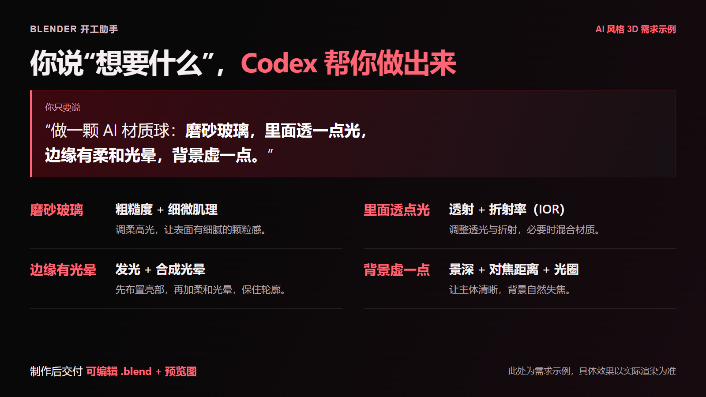
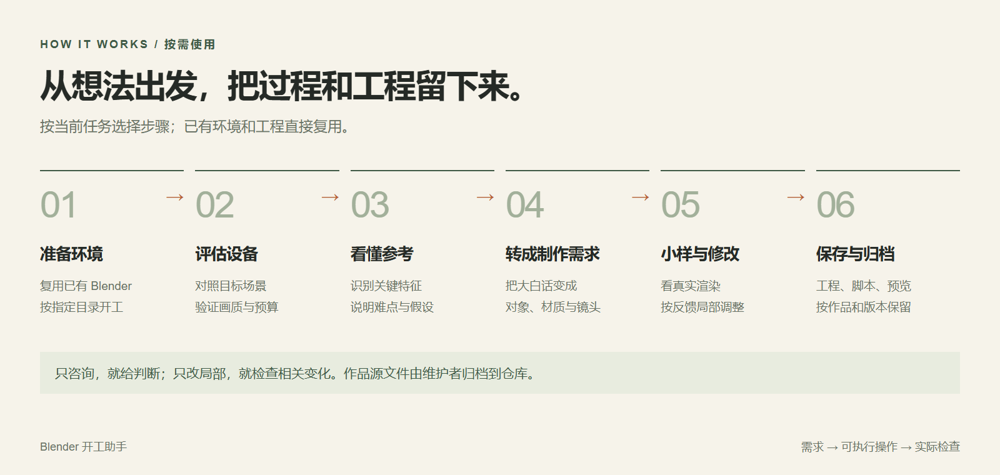
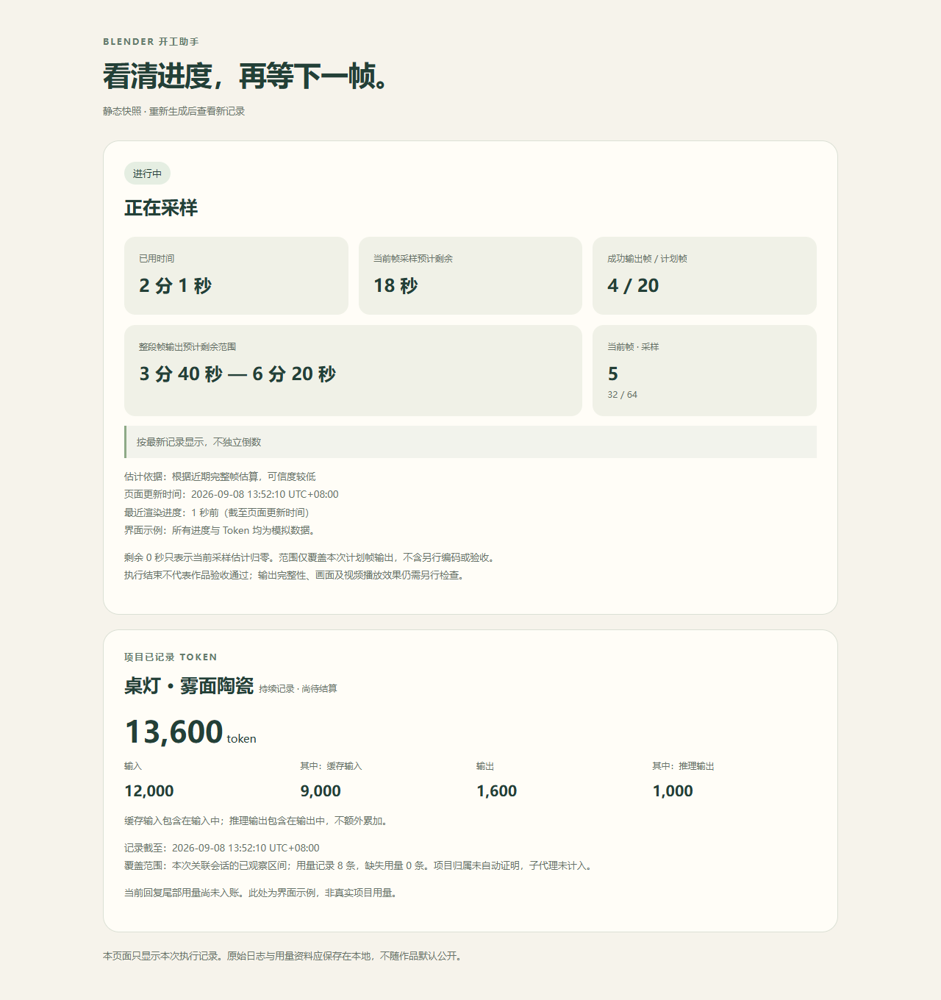

# Blender 开工助手

**不会建模，也可以从一张参考图、一句大白话开始。**

[English](README.en.md) · [开始使用](docs/quickstart.md) · [AI 材质球案例](projects/ai-brand-materials/README.md) · [全部作品](projects/README.md)

这是一个给 Codex 使用的 Blender 新手 Skill，当前为 **v05 / Early Preview**。从准备软件、评估电脑和参考图，到制作、看预览、继续修改，帮助你把想法做成可编辑的 `.blend` 工程。

## 当 AI 有了触感


**提示词 · 根据本案例整理的示例**

> 给这四个 AI 品牌做一组材质球：OpenAI 像金属，Claude 像木头，DeepSeek 像石头，Gemini 像磨砂玻璃。标识要刻进球面，背景用粉色。先给我看小样，再决定哪里要改。

**Token 用量：** 这组单图未单独记录；相关制作任务的历史统计见 [用量说明](docs/showcase-measurements.md)。<br>
**显卡渲染耗时：** 制作设备档案为 **RTX 4070 Ti / 12 GB**；四张原图合计约 **15.1 秒**（历史整组进程计时，含启动、场景载入和保存；Cycles / OptiX，每张 960 × 1280、128 samples）。显卡型号与计时口径见 [用量与耗时说明](docs/showcase-measurements.md)。

**[看制作过程与源文件 →](projects/ai-brand-materials/README.md)** · [下载 20 秒动画预览](projects/ai-brand-materials/preview.mp4) · [试试这组提示词](projects/ai-brand-materials/prompts.md)

<sub>四张原生 Blender 渲染拼图，未做 AI 图像精修。提示词是制作回顾中的整理稿；计时仅覆盖这次静图输出，不含前期建模、修改或整段动画制作。[参考与素材出处](projects/ai-brand-materials/credits.md)</sub>

## 从这三句话开始

安装与启用方法见 [快速开始](docs/quickstart.md)。启用后，可以直接说：

> 帮我准备 Blender，把软件和项目放到我指定的盘里。先看看有没有可用的安装。

> 看看这张参考图能做到什么程度，我的电脑适不适合出 4K 静帧。先给评估和建议，暂时不制作。

> 打开这组 AI 材质球工程，把木头凹槽里的反光减弱一些，其他球和构图保持不变。另存一版，给我看预览。

## 这些地方，它能帮上忙

| 你可能会问 | 它会怎么帮你 |
| --- | --- |
| 第一次用 Blender，软件和文件该放哪？ | 先看看电脑里有没有可用的 Blender；需要安装时，再按你指定的位置安排软件和项目。 |
| 我的电脑带得动 4K 或动画吗？ | 结合你的电脑和准备做的场景，必要时先做小样测试，说明哪里可能吃力、还需要验证什么。 |
| 这张参考图，能做出类似的效果吗？ | 看看哪些地方容易做、难点在哪，以及预计会和原图有哪些不同。 |
| 想要“磨砂、通透、梦幻”的感觉，怎么说？ | 把这些感觉整理成材质、灯光和镜头的具体做法，方便接着制作。 |
| 做出来太塑料、太糊，怎么改？ | 先找出影响效果的地方，再按你的反馈调整，并检查你满意的部分有没有受到影响。 |
| 做好的文件，能打开继续改吗？ | 保存工程后，重新打开检查，再渲染并查看预览，让你知道实际效果和还有哪些问题。 |
| 这次制作已经用了多少 Token？ | 从指定会话里开始记录，告诉你已经记了多少、记到什么时候，还有哪些用量没记全。 |
| 渲染还要等多久？ | 为这次启动的渲染显示进度；有足够记录后，再估计还要等多久。暂时算不出来也会说明。 |

你可以直接描述想要的效果，再看预览、提修改意见。比如“光再柔和一点”“背景虚一点”，Codex 会把这些反馈落实到 Blender 里的相应调整。



## 想先问问，还是直接开做？



- **先聊聊想法**：比如“这张图能不能做”“为什么看起来像塑料”。先给解释和建议，等你提出制作需求，再开始动手。
- **开始做一个版本**：你说“按这张图帮我做出来”，它会把影响结果的关键要求弄清楚，先出预览，再逐步完善。
- **接着改已有作品**：比如“木头凹槽别那么亮”。从你指定的最新版工程继续，检查需要保留的部分，并另存一版。
- **电脑或时间有点吃紧**：先说清楚按原要求做会卡在哪里，再给出可以调整的地方和相应取舍，由你决定怎么继续。

参考图的 **0–100 分属于方案评估**，应附依据、置信度和预计差异。它不表示还原百分比或成功概率，缺少关键证据时保留待评估项。看不到的模型背面也需要明确假设。

## v05：用量与渲染进度



<sub>界面示例使用模拟数据，展示字段和状态；不代表这些作品的真实用量或渲染速度。</sub>

**项目用量**支持一个明确指定的本地 Codex 会话来源，从开始记录的基线累计。缓存输入和推理输出显示为子项，不重复相加；结束时保留待补记状态。旧作品缺少原始记录时显示未知，混合项目和子代理用量不自动拆分或合并，也不换算订阅额度与费用。

**渲染进度**由本地程序更新页面，无需每秒调用模型。首版支持本次启动的受控 PNG 静图或帧序列；首帧单列，至少三个后续完整帧后才给经验范围。时间可以上升，信息过期会撤回估计，执行结束仍需检查输出和画面。

[查看使用方法、限制与验证记录 →](docs/usage-progress.md)

## 作品、源文件与精简对话

下面三个早期作品也保留了提示词、工程与制作记录。它们与上面的 AI 材质球都是作者单独整理的 GitHub 展示资料，独立于 Skill，不作为当前版本一次生成的效果验证。

### 粉色装置


**提示词 · 整理示例**

> 按参考图做一个粉色玩具装置：珊瑚粉褶柱、蓝色背板、薄荷色珠子和金白悬球。陶瓷温润、金属有反光、绒面柔软。先确认造型，再调整材质和灯光。

**Token 用量：** 未记录。<br>
**显卡与渲染耗时：** 显卡型号未记录；原生底稿 **4.75 秒**（1080 × 1048、128 采样）。上图另含图像精修，这个时间不含精修步骤。[计时说明](docs/showcase-measurements.md)

[源文件与原生渲染](projects/pink-installation/README.md) · [完整提示词](projects/pink-installation/prompts.md) · [制作过程与出处](projects/pink-installation/conversation.md)

### 毛绒兔骑士


**提示词 · 整理示例**

> 做一只站在树墩上的粉色毛绒兔骑士，举着金色水晶剑，拿着木盾。绒毛要柔软，剑光轻轻照到脸和手，背景放三朵圆润的云。先看小样，再检查毛发和发光效果。

**Token 用量：** 未记录。<br>
**显卡与渲染耗时：** 显卡型号未记录；原生底稿 **1 分 11.04 秒**（1000 × 1000、1024 采样）。剑光与云朵另经图像精修，未写回 `.blend`，不计入这里的时间。[计时说明](docs/showcase-measurements.md)

[源文件与原生渲染](projects/plush-rabbit-knight/README.md) · [完整提示词](projects/plush-rabbit-knight/prompts.md) · [制作过程与出处](projects/plush-rabbit-knight/conversation.md)

### 悬浮几何动画


**提示词 · 整理示例**

> 让密褶球、空心管、圆环和方框各自转动、起伏，镜头保持不动。做白底彩色、黑金、冰蓝、紫黄和黑白五套配色，每套 6 秒，连成 30 秒动画。先检查穿插和管口，再出整片。

**Token 用量：** 未记录。<br>
**显卡渲染耗时：** 完整成片总耗时未记录；成片为 720 × 1280、30 fps、900 帧。渲染设置与记录范围见 [用量与耗时说明](docs/showcase-measurements.md)。

[源文件与成片](projects/floating-geometry-animation/README.md) · [完整提示词](projects/floating-geometry-animation/prompts.md) · [制作过程与出处](projects/floating-geometry-animation/conversation.md)

<sub>上面的短提示词是根据已有记录整理的示例，不是逐字聊天。两张早期静图的图像精修效果未写回 `.blend`。耗时缺失不代表零耗时，也不能据此推算其他显卡或 Mac 的速度。[全部作品](projects/README.md) · [用量与耗时说明](docs/showcase-measurements.md)</sub>

准备分享作品时，维护者可按 [作品归档约定](docs/project-archive.md) 整理源文件和输入来源。日常使用 Skill 无需执行这些资料整理步骤。

每个作品的 `conversation.md` 保留关键需求、修改反馈与对应版本，让你能看到“大白话怎样变成结果”。按 [精简对话方法](docs/conversation-archive.md) 保留有意义的返工，区分原话与摘要。AI 材质球的过程依据现有制作记录整理，完整说明见 [制作回顾](projects/ai-brand-materials/conversation.md)。

## 设备支持与验证范围

| 项目 | 当前状态 |
| --- | --- |
| Windows 自动安装 | 支持 x64、Blender 5.2 系列的独立目录安装；优先复用已有可用版本 |
| Windows 制作与复核 | Blender 5.2.1 已完成实际执行与台灯案例验证 |
| Mac 设备评估 | 已实现 Intel / Apple Silicon、统一内存与 Metal 相关评估路径；Mac 真机待验证 |
| Linux | 尚未建立完整安装与制作验证记录 |
| 4K / 动画 | 根据目标场景与设置单独评估；简单静帧的结果不能证明复杂动画的耗时或稳定性 |

v04 已完成 **14 项执行检查、5 组文字决策试用和 1 次独立工程修改试用**。其中中断处理使用模拟检查。这些是开发阶段的有限验证，不构成任意参考图的质量保证。

v05 新增用量边界与异常记录检查、真实小图帧序列试渲染、超时和失败状态联调，以及桌面／手机尺寸的面板检查。具体范围见 [v05 验证记录](docs/usage-progress.md#验证记录)；Mac 真机与复杂动画仍未因此得到验证。

生成后会分别检查进程、工程结构和实际预览。基础检查器覆盖静态场景的一部分问题；视觉质量、拓扑、3D 打印和复杂动画还需要与用途相符的检查。限时执行器控制本次启动的 Blender 进程，不能完整隔离任意脚本的访问行为。

## 仓库结构

```text
skills/blender-beginner/
  SKILL.md            # Codex 技能入口
  agents/             # 技能显示信息
  references/         # 评估、制作、反馈与验收规则
  scripts/            # 安装、探测、限时执行与检查工具
  assets/             # 台灯起步模板
docs/                 # 使用说明与介绍素材
projects/             # 展示作品、可编辑源文件与精简对话
templates/            # 版本说明与精简对话模板
```

技能采用本地 Blender 脚本与文件交付流程。实时 MCP 连接可按需另行接入；当前仓库未预先配置该连接。

从 [快速开始](docs/quickstart.md) 安装，或先阅读 [技能入口](skills/blender-beginner/SKILL.md) 了解完整行为。
