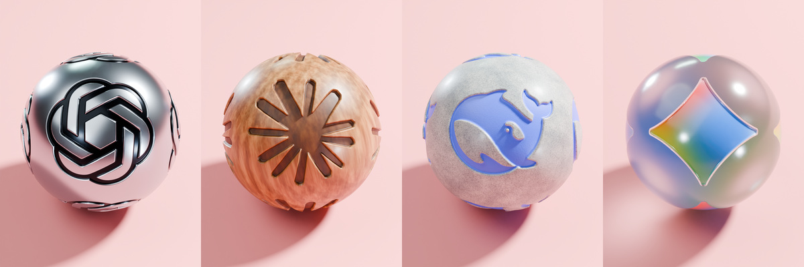
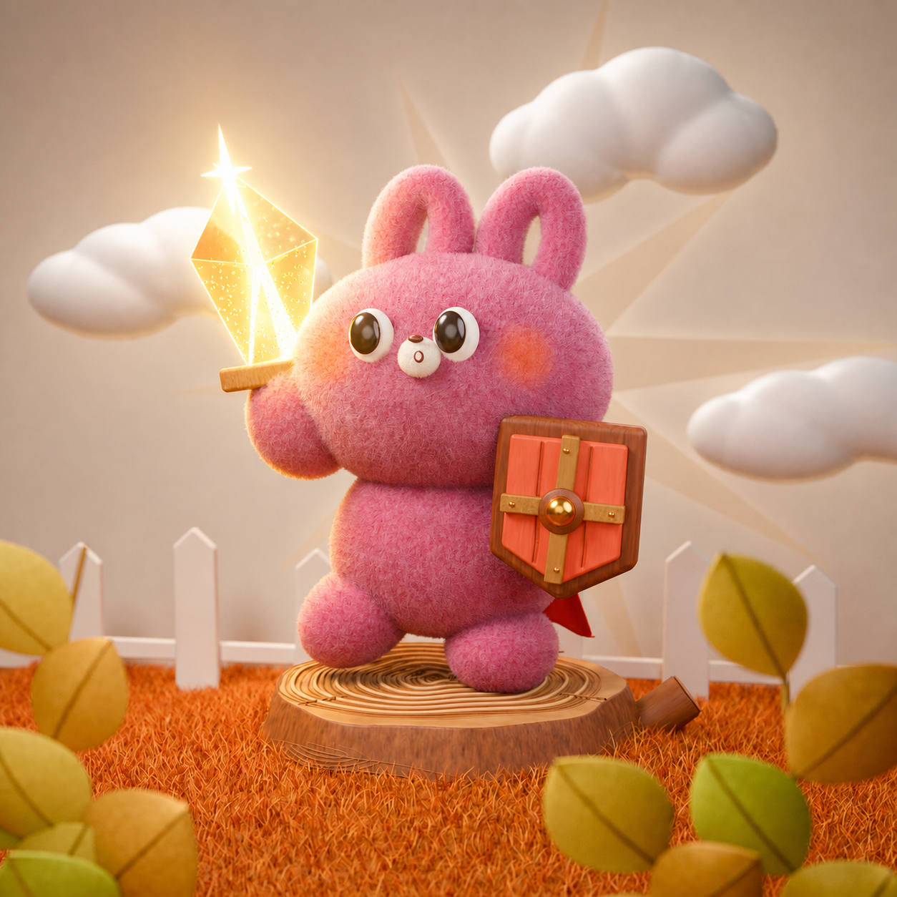
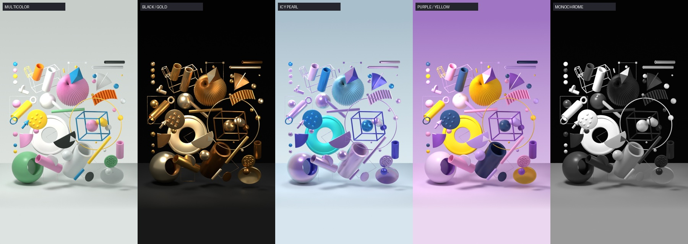

# 看作品，也看看怎么做

这里收录作者的早期 Blender 实践和后续演示：成品、可编辑源文件、提示词与精简制作过程。它们是 GitHub 展示资料，独立于 Skill；安装 Skill 只需要 `skills/blender-beginner/`。

## 当 AI 有了触感

> 把这段解压动画里的小球换成四个 AI 品牌：OpenAI 做银色金属，Claude 做温暖木纹，DeepSeek 做浅色石材，Gemini 做磨砂玻璃。让标识真的凹进球面，小球滚过粉色柱阵时，柱子也跟着变色。再各拍一张单球海报，保留原生 Blender 工程。

**Token 用量：** 单图未单独记录；相关制作任务的历史用量见[统计说明](../docs/showcase-measurements.md)。 
**显卡渲染时间：** 四张单球共 15.124 秒，含工程加载与图片保存；960 × 1280，Cycles / OptiX，128 samples。 
**显卡记录：** 制作设备档案为 RTX 4070 Ti 12 GB；这批渲染日志未单独写入显卡型号。 
**展示规格：** 四张单球图各为 960 × 1280；动画预览为 1080 × 1080、30 fps、20 秒。

[完整案例](ai-brand-materials/README.md) · [源文件](ai-brand-materials/source/scene.blend) · [动画](ai-brand-materials/preview.mp4) · [分轮提示词](ai-brand-materials/prompts.md) · [实测记录](../docs/showcase-measurements.md) · [出处](ai-brand-materials/credits.md)

这组图片来自原生 Blender 渲染。工程内的 200 帧动作循环重复三次，组成 20 秒视频；[检查记录](ai-brand-materials/verification.json) 保留了工程、静图与视频各自的验证范围。

## 粉色装置

> 按参考图做一个粉色玩具装置：珊瑚粉褶柱、蓝色背板、薄荷珠和金白悬球，保留上下堆叠的趣味感。先给我看构图小样，再把陶瓷、金属和短绒做出不同的触感。保存可编辑的 Blender 工程；图片精修另存一份。

**Token 用量：** 未记录。 
**原生渲染时间：** 4.75 秒；EXR 母版记录，显卡型号未记录，不含图片精修。 
**底稿设置：** Cycles，1080 × 1048，128 samples。

[完整案例](pink-installation/README.md) · [源文件](pink-installation/source/editable-base.blend) · [分轮提示词](pink-installation/prompts.md) · [制作过程](pink-installation/conversation.md) · [出处](pink-installation/credits.md)

上图为生成式图像精修成品；新增效果未写回 `.blend`。同时保留了[原生渲染](pink-installation/native-render.png)与 [EXR 母版](pink-installation/source/beauty.exr)。

## 毛绒兔骑士

> 把参考图里的兔子做成一位毛绒小骑士：粉色绒毛、金色水晶剑、橙色木盾，站在树墩上，背后有三朵软软的云。毛发要蓬松，剑光轻轻照亮靠近它的脸和耳朵。先确认姿势，再细化材质，保留能继续修改的 Blender 工程。

**Token 用量：** 未记录。 
**原生渲染时间：** 1 分 11.04 秒；EXR 母版记录，显卡型号未记录，不含图片精修。 
**底稿设置：** Cycles，1000 × 1000，1024 samples。

[完整案例](plush-rabbit-knight/README.md) · [源文件](plush-rabbit-knight/source/editable-base.blend) · [分轮提示词](plush-rabbit-knight/prompts.md) · [制作过程](plush-rabbit-knight/conversation.md) · [出处](plush-rabbit-knight/credits.md)

上图另做过生成式图像精修，最后的剑光与云朵效果未写回 `.blend`；可另看[原生渲染](plush-rabbit-knight/native-render.png)与 [EXR 母版](plush-rabbit-knight/source/beauty.exr)。

## 悬浮几何动画

> 让参考图里的几何玩具动起来：褶球慢慢转，空心管错开起伏，圆环和方框轻轻摇摆，镜头保持不动。做白底彩色、黑金、冰蓝虹彩、紫黄糖果和黑白五种配色，每种播放 6 秒，拼成 30 秒竖屏动画。先检查动作小样，再输出成片和可编辑工程。

**Token 用量：** 未记录。 
**显卡渲染时间：** 未记录；保留了 OptiX 设置，没有具体显卡型号与全片渲染耗时。 
**成片规格：** Cycles / OptiX，720 × 1280，64 samples；30 fps，900 帧，30 秒。

[完整案例](floating-geometry-animation/README.md) · [源文件](floating-geometry-animation/source/scene.blend) · [动画](floating-geometry-animation/final.mp4) · [分轮提示词](floating-geometry-animation/prompts.md) · [制作过程](floating-geometry-animation/conversation.md) · [出处](floating-geometry-animation/credits.md)

成片来自 Blender 原生动画渲染。每套配色内的动作可循环，整片首尾颜色不同；音轨来源与重建范围见作品页。

以上提示词均根据现有材料整理，方便复制尝试，不是历史聊天原话。后面三个作品按 2026-09-06 资料包顺序展示，不推定准确开工日期；所有案例都是已有作品的归档，不作为当前 Skill 一次生成的效果证明。未记录的用量与耗时保留为空缺，具体范围见[制作消耗说明](../docs/showcase-measurements.md)。

历史功能演示另见 [绿色台灯 · v001 / v002](green-desk-lamp/README.md)，演示已有工程的局部材质修改。

## 源文件与检查

三份核心工程沿用原文件字节，导入时重新打开检查，结果见 [本次源文件检查](early-works-source-check.md)。历史初版、五套独立动画场景与制作脚本保留在 [重建支持资料](_early-work-support/README.md)。[导入清单](early-works-manifest.json) 记录附件内相对来源及文件 SHA256。

下载工程时，在 GitHub 文件页选择 **Download raw file**，或下载并解压整个仓库。继续编辑优先打开各作品页面链接的核心 `.blend`；历史脚本的适用范围见重建支持说明。
