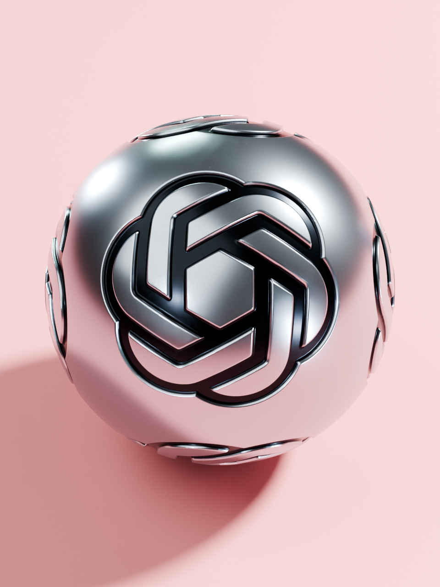
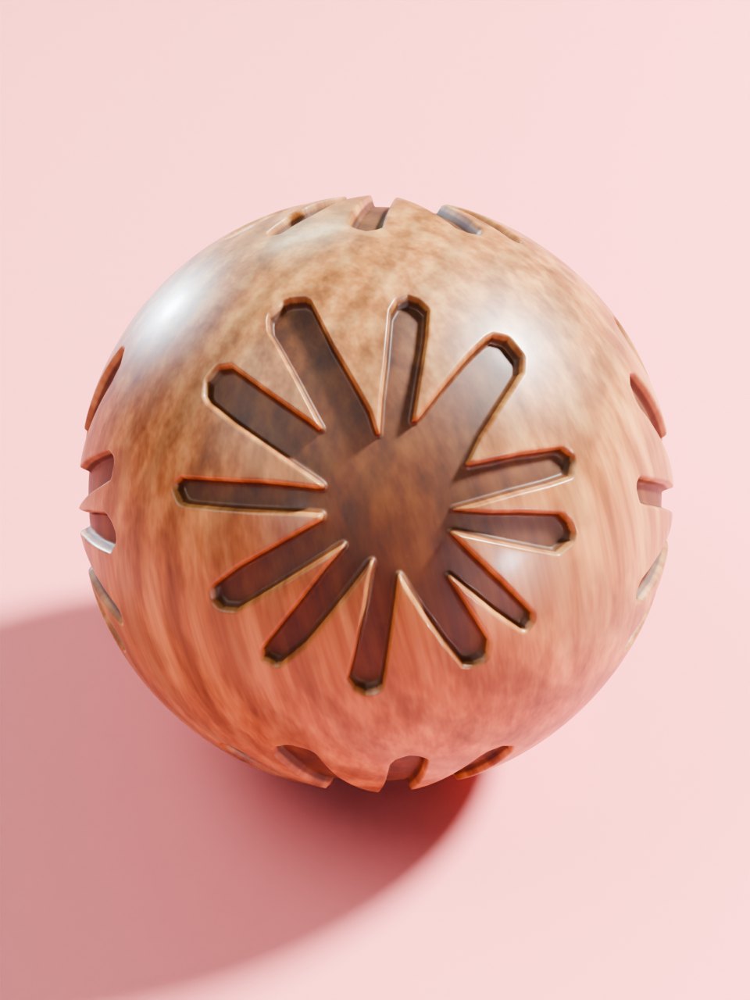
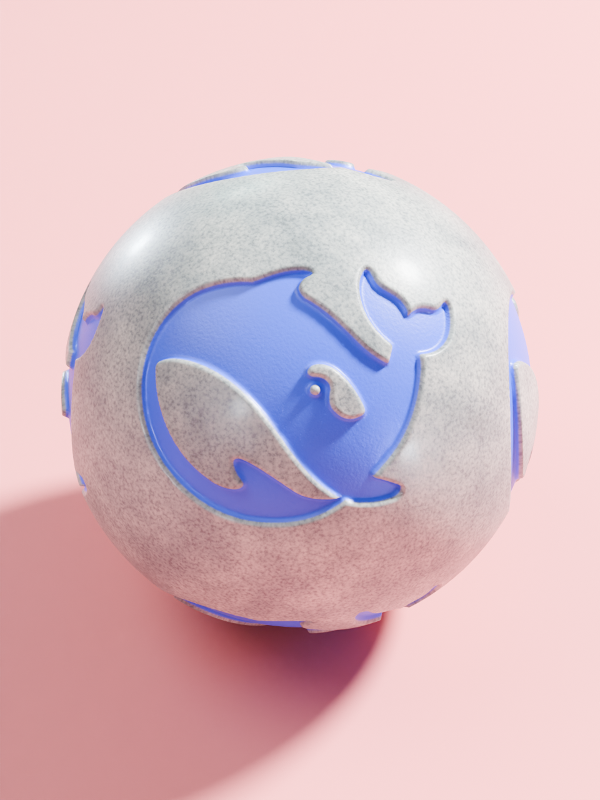
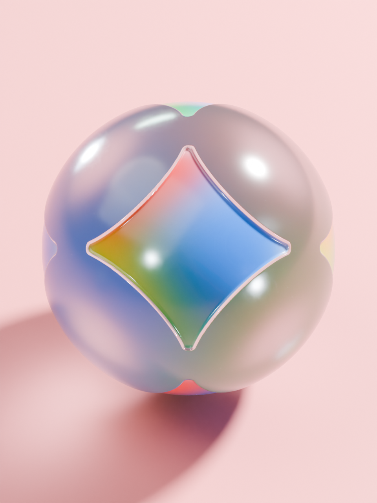

# 当 AI 有了触感

如果把每天聊天的 AI 变成桌上的小物件，它们摸起来会是什么感觉？四个品牌，四种材质，下面都是本项目的真实 Blender 渲染。

图片下的提示词是根据作品整理的**可复用示例**，不是历史逐字聊天。每张图后保留用量与渲染记录，缺失的读数直接注明。

## OpenAI · 一颗银色金属球

**可以这样说：**

> 把 OpenAI 的标识做成一颗银色金属球，像刚打磨过的小收藏品。球面有清晰的灯光反射和细微拉丝，标识刻进表面，凹槽暗一点。放在柔和的粉色背景上，球体完整，正面的标识清楚，输出一张 960×1280 的竖图。

**本图 Token：** 未单独记录。 
**显卡与耗时：** RTX 4070 Ti 12 GB · **4.30 秒**。 
**设置：** 960 × 1280，Cycles / OptiX，128 采样。[统计口径](../../docs/showcase-measurements.md)

## Claude · 有温度的木纹

**可以这样说：**

> 给 Claude 做一颗暖木头的小球，能看见自然木纹，星芒标识像真的雕进去。木纹延续到凹槽里，里面暗一点、反光少一点，别像涂了厚漆的塑料。沿用粉色背景和柔和灯光，输出 960×1280 的单球竖图。

**本图 Token：** 未单独记录。 
**显卡与耗时：** RTX 4070 Ti 12 GB · **3.06 秒**。 
**设置：** 960 × 1280，Cycles / OptiX，128 采样。[统计口径](../../docs/showcase-measurements.md)

## DeepSeek · 把蓝鲸嵌进石头

**可以这样说：**

> 做一颗浅色石材球，像被磨圆的小石头，表面有细小的矿物颗粒和轻微凹凸。把 DeepSeek 的蓝鲸标识嵌进球面，保持清楚的蓝色和凹槽边缘。背景继续用粉色，光线柔和，输出 960×1280 的竖图。

**本图 Token：** 未单独记录。 
**显卡与耗时：** RTX 4070 Ti 12 GB · **1.94 秒**。 
**设置：** 960 × 1280，Cycles / OptiX，128 采样。[统计口径](../../docs/showcase-measurements.md)

## Gemini · 把彩虹藏进玻璃

**可以这样说：**

> 让 Gemini 变成一颗磨砂玻璃球，透一点，有柔和的高光。彩色星形标识嵌在表面，像把一小片彩虹藏进了玻璃。保留星形轮廓与颜色过渡，放在粉色背景上，输出 960×1280 的完整单球竖图。

**本图 Token：** 未单独记录。 
**显卡与耗时：** RTX 4070 Ti 12 GB · **2.91 秒**。 
**设置：** 960 × 1280，Cycles / OptiX，128 采样。[统计口径](../../docs/showcase-measurements.md)

以上单图时间来自原始 PNG 内嵌的 **Blender RenderTime**。显卡型号取自同一制作电脑的设备档案，本批渲染日志记录了 OptiX，未另写型号。四图整个运行过程为 **15.124 秒**，包含启动、加载和保存；这些是本次设置下的历史读数，不是其他设备或 4K 输出的预计时间。详见 [用量与渲染记录](../../docs/showcase-measurements.md)。

### 相关制作任务历史用量

历史快照记录 **33,589,748 Tokens**，包含主任务与 8 个子任务，截至北京时间 **2026-09-08 09:46**；缓存输入已包含在总数中。这个截点早于当天 14:00 导出的四张海报，因此不能分摊成单图用量，也不代表项目完整用量或费用。统计方法与覆盖范围见 [用量说明](../../docs/showcase-measurements.md)。

四张原图均以原生 960 × 1280 渲染，没有用生成式图片精修替代工程里的效果。[四球拼图](preview.jpg) 只做了缩放与并排排版。

## 下载以后，接着玩

点击下面的工程或图片链接，在 GitHub 文件页选择 **Download raw file** 下载；也可以在仓库首页选择 **Code → Download ZIP**，解压后保留整个作品文件夹。

打开 [source/scene.blend](source/scene.blend)，可以继续修改四球材质、标识凹刻和柱阵动画。工程保留原生 **3840 × 3840、30 fps、200 帧循环**；展示视频把这个循环重复三次，配上原创音效，成为 20 秒成片。

| 文件 | 内容 |
| --- | --- |
| [可编辑工程](source/scene.blend) | 四球、柱阵、材质、灯光、相机和动画 |
| [OpenAI](images/openai.png) · [Claude](images/claude.png) · [DeepSeek](images/deepseek.png) · [Gemini](images/gemini.png) | 四张原生单球 PNG，960 × 1280 |
| [动画预览](preview.mp4) | 1080 × 1080，30 fps，20 秒，带声音 |
| [原始音效](source/audio.wav) | 20 秒立体声 WAV；用于视频后期合成，未嵌入 `.blend` |
| [单球渲染脚本](source/render_portraits.py) | 从保存的工程重新渲染单球图片；所需方向数据在 [atlas-orientations.json](source/atlas-orientations.json) |
| [文件清单](manifest.json) · [检查记录](verification.json) | 归档文件、源工程与公开副本的对应关系，以及实际检查范围 |

原工程使用 Blender 5.2.1 制作。单球脚本用于重新取景和渲染，覆盖的是海报输出步骤；完整场景以保存的 `.blend` 为准。原生 4K 渲染比浏览这里的 1080 视频更耗时，继续制作时可以先让 Codex 按你的电脑做一次小尺寸预览。

这个项目从一段粉色柱阵动画参考开始，随后加入四个 AI 品牌、真实几何凹刻和不同材质。小样中又调整了木槽反光与雕刻边缘，确认后完成动画，最后另拍四张单球海报。完整过程见 [制作回顾](conversation.md)。

这是已有作品的整理，保留了多轮调整后的结果，不是 Skill v05 的一次生成演示。GitHub 案例资料与可安装的 Skill 分开维护。

[制作回顾](conversation.md) · [可复用提示词](prompts.md) · [参考与素材来源](credits.md) · [全部作品](../README.md)
