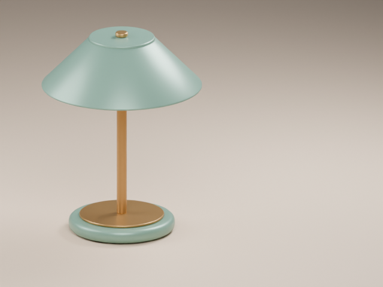
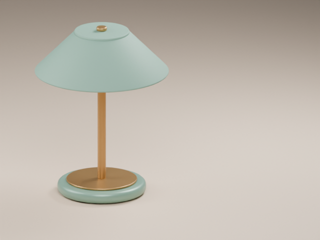

# 绿色台灯：从搪瓷感到哑光陶瓷

一个可打开、可继续修改、可按脚本复现的 Blender 小案例。两张预览均来自对应工程的真实 Blender 渲染，没有用生成图片替代工程结果。

[阅读制作过程回顾](conversation.md)：依据现有版本记录整理，无原始聊天摘录；关键需求与修改结果对应下方工程版本。

| 初版 · v001 | 材质修改 · v002 |
| --- | --- |
|  |  |
| [打开工程](versions/v001/scene.blend) · [制作需求](versions/v001/brief.md) · [重建脚本](versions/v001/build.py) | [打开工程](versions/v002/scene.blend) · [修改需求](versions/v002/brief.md) · [修改脚本](versions/v002/edit.py) |

**最新版本：[v002 / scene.blend](versions/v002/scene.blend)。** 下载后在 Blender 中打开，数字键盘 `0` 查看相机，`F12` 渲染。没有数字键盘时可用菜单“视图 → 摄像机 → 活动摄像机”。

## 这个案例演示什么

- v001 用独立网格、程序材质和灯光搭建绿色台灯，并保存 640 × 480 的构图。
- v002 将“灯罩看着太塑料，改成绿色哑光陶瓷”转成具体的材质修改。
- 灯罩、顶盖原本与底座共用一个材质。修改时复制材质，仅分配给灯罩与顶盖，避免连带改变底座。
- 保留几何、相机、灯光、底座、支架和画幅；历史版本可以直接打开对照。

这里的 v001 是从 Skill 测试素材整理出的**演示初版**，包括脚本设置的相机横移；它不是一位真实用户的手动操作记录。v002 是在这份已保存工程上完成的实际材质修改。目录编号是本公开案例的整理版本，不代表发布前的所有内部尝试。

## 渲染与文件事实

已用 **Blender 5.2.1 LTS** 重新打开并检查。这两版均为 Cycles、CPU、12 采样、640 × 480、AgX 的静态第 1 帧；预览主要展示整体构图与高光变化，细小陶瓷肌理在此尺寸下并不明显。没有把这个小图案例作为 4K、动画或其他设备的性能结论。

工程含 12 个对象，其中 8 个为网格。材质为程序材质，本案例不需要另行下载贴图，也没有随包附带外部参考图。针对本案例检查了图像、链接库、字体、影片片段、声音、缓存文件与文本数据块；这不构成对任意 `.blend` 文件的完整资产或隐私审计。

## 从脚本复现

以下命令在**仓库根目录**执行。`blender` 代表你的 Blender 可执行文件；若未加入环境变量，请替换为安装路径。推荐使用已验证的 Blender 5.2.1 LTS，其他版本的节点接口和渲染可能不同。

所有结果都写入新的 `reproduced/` 目录，已有文件会被脚本拒绝覆盖。再次运行前请换一个新的输出目录。命令包含禁用工程自动执行脚本的选项；这里显式指定的、可阅读的制作脚本仍会运行。

```sh
blender --background --factory-startup --disable-autoexec --python-exit-code 1 --python projects/green-desk-lamp/versions/v001/build.py -- --output reproduced/green-desk-lamp/v001/scene.blend
blender --background --factory-startup --disable-autoexec --python-exit-code 1 --python projects/green-desk-lamp/versions/v002/edit.py -- --input reproduced/green-desk-lamp/v001/scene.blend --output reproduced/green-desk-lamp/v002/scene.blend
```

用界面打开复现的工程按 `F12` 渲染即可。也可在命令行渲染，例如：

```sh
blender --background --factory-startup --disable-autoexec reproduced/green-desk-lamp/v002/scene.blend --render-output //preview- --render-frame 1
```

最后一条命令把 `preview-0001.png` 放在复现的 v002 工程旁。脚本重建关注场景和修改的可复现性；不保证 `.blend` 二进制字节或不同设备上的渲染像素完全相同。持续执行时可使用 Skill 自带的限时执行工具。

## 版本记录

| 版本 | 输入 | 本版变化 | 保留内容 |
| --- | --- | --- | --- |
| v001 | 无外部参考图；脚本搭建 | 初版台灯、摄影棚灯光、保存相机构图 | 后续版本的基线 |
| v002 | v001 / scene.blend | 灯罩与顶盖使用独立的绿色哑光陶瓷材质 | 模型、底座材质、金色部件、相机、灯光、分辨率 |

需要继续修改时，以最新保存的工程为输入，并新增 `versions/v003/`。不要覆盖旧工程，否则预览和需求记录将无法与对应版本对照。
