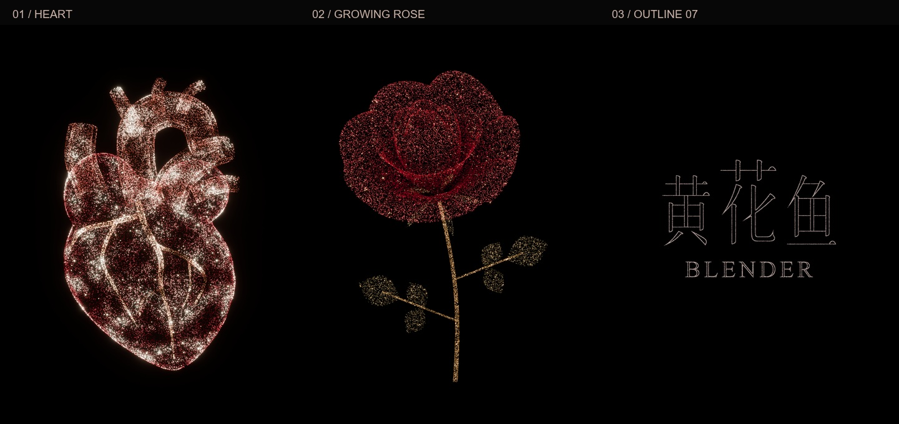

# 心脏与玫瑰 · 璃光细线

**20 秒 · 3:4 竖版 · 原生 3072 × 4096 · 30 FPS · 无声**

红金粒子汇成搏动的心脏，收束后长出玫瑰；花瓣化为「黄花鱼 / BLENDER」两排细线文字，最后随风散去。

[观看 / 下载 1080 预览](preview.mp4) · [下载 4K 成片](https://github.com/huangxin-design/blender-beginner/releases/download/works-heart-rose-2026-09-18/heart-rose-outline07-4k.mp4) · [源工程与制作资料](source/README.md) · [直接下载最终 .blend](source/HuangHuaYu_Outline07_4K.blend)

## 从这里开始，作为一件新作品

作者指定以这条需求作为本案例起点：

> 参考竖版3:4的比例，制作4k高清视频， 心脏 花朵的粒子效果，20s，

这是制作会话中的原话摘录。此前的 10 秒心脏动画、横版排版探索不计入本案例的迭代轮次；既有心脏工程是当时的制作依赖，未随当前公开资料提供。此后实际经历了花朵返工、片尾改名、四款字体提案、十款艺术字提案和最终成片。归档沿用真实的 V7–V11 文件编号，不重新编造“从零制作”的历史。

本案例是作者的独立作品与制作经验，属于 GitHub 展示资料，不增加 Skill 的功能或一次生成验证数量。

## 节奏与构图

| 时间 | 画面 |
| --- | --- |
| 0–4.8 秒 | 粒子聚成解剖心脏，轻微搏动 |
| 4.8–8.7 秒 | 收束成种子，花茎、叶片和花苞依次生长 |
| 8.7–12.7 秒 | 21 片杯状花瓣逐层展开 |
| 12.7–15.7 秒 | 玫瑰粒子汇成两排文字 |
| 15.7–17 秒 | 完整呈现选定的 07「璃光细线」 |
| 17–19.6 秒 | 文字逐粒松散、漂移、变淡 |
| 片尾 | 黑场结束，不循环 |

心脏约占画面高度的 73%–74%，完整玫瑰约占 78%。背景保持黑色，主要视觉变化来自粒子位置、大小、亮度与花朵生长；没有增加环形流线。

## 实际经历的版本

| 版本 | 结果与反馈 | 文件 |
| --- | --- | --- |
| V7 | 完成 20 秒竖版心脏、花朵与文字；用户反馈花朵不好看，要求生长的玫瑰 | [阶段说明](versions/v007/README.md) |
| V8 | 改成花茎、花苞、杯状花瓣的生长过程，文案改为「黄花鱼 / BLENDER」；随后收到字体反馈 | [工程、造型脚本与说明](versions/v008/README.md) |
| V9 | 四款字体静帧与粒子预案；没有制作四条动画 | [四款提案](versions/v009/README.md) |
| V10 | 十款更艺术化的提案；用户选中 07「璃光细线」 | [十款提案及所选方案](versions/v010/README.md) |
| V11 | 采用细线轮廓与淡玫瑰金色，完成文字转场、随风消散及 4K 输出 | [最终工程、复现与验收](source/README.md) |

[精简制作对话](conversation.md)保留用户反馈与处理摘要；[提示词](prompts.md)是事后整理的可复用示例，两者分别标注。

## 可以复用的经验

1. **先把“生长”拆成顺序。** 花茎、叶片、花苞与花瓣有各自的出现时机，改善仅靠粒子插值时“从一团变成另一团”的观感。
2. **先选字，再做动画。** 用静帧确认中文字形、中英文比例和留白，选定后才将轮廓采样为粒子。
3. **局部修改要有保留依据。** V11 改文字时检查前段相机、粒子位置与半径；复用已完成的前 380 帧，避免重做心脏和玫瑰。
4. **渲染完成还要检查成片。** 600 帧原生分辨率软硬解码对比、片尾黑场检测与实际播放，分别解决不同问题。

[完整经验：造型、文字采样、局部渲染、编码验收 →](lessons.md)

## 制作记录与验证范围

Blender 5.2.1 / Eevee / 32 采样，67,579 个持续参与变形的粒子。最终工程中的字形已转换为粒子目标，直接渲染不需要重新安装字体。

**Token：未独立统计。** 没有从这条需求开始的独立记录基线，不把整个制作会话的累计用量归给本作品。

**已知耗时：V11 后段 165 张区域渲染帧，至最后一帧保存约 15 分 0.3 秒。** 该批次含启动、载入、粒子范围计算、渲染和保存；当时存在并行显卡任务。前 380 帧沿用 V8，40 帧文字停留与 15 帧黑场复用静帧。这个时间不代表 600 帧全部从零渲染，也不包含此前版本、样帧、合成编码、验收和改稿。[逐帧批次计时](source/qa/render-timing.json)

已有交付检查覆盖全部 600 帧的 **3072 × 4096 原生 YUV420P 采样**，FFmpeg `h264` 与 NVIDIA `h264_cuvid` 解码差异为 0；4K 与 1080 预览均在 Codex Browser 实际播放到 20 秒黑场。没有记录播放器丢帧计数，未验证所有设备。

当前公开资料保留最终视频、V8 / V11 工程与相关制作脚本；V7 素材和早期基础工程已撤下。保留的工程与视频仍为原始字节，网页缩略图只做缩放和并排展示。公开检查记录移除了本地预览地址。归档检查与已有制作验收分别记录在 [verification.json](verification.json)；当前文件与下载件的 SHA256 见 [manifest.json](manifest.json)。

[素材与字体说明](credits.md) · [全部作品](../README.md)
