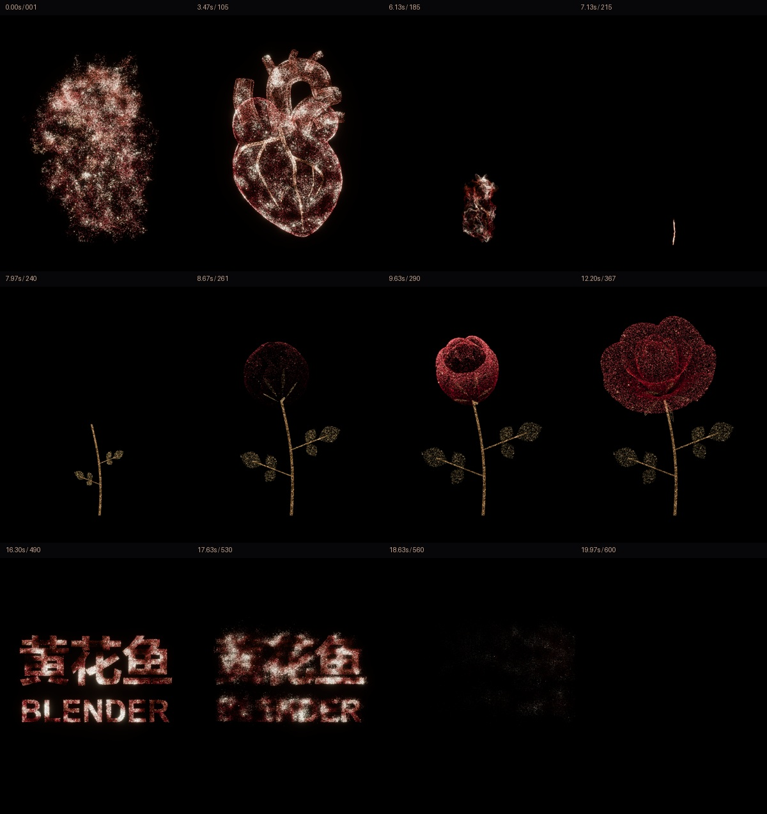

# V8 · 生长玫瑰与新片尾

**需求：** 将花朵改为生长的玫瑰，文案改为「黄花鱼 / BLENDER」。[对应第 2 轮](../../conversation.md)

**改动：** 重做杯状花瓣、花茎、复叶和花萼；分开控制种子、枝叶、花苞和分层开放。67,579 个粒子、21 片花瓣参考曲面。随后用户要求重新设计字体，V11 沿用本版前 380 帧的心脏与玫瑰。

**环境：** Blender 5.2.1 / Eevee / 32 samples，3072 × 4096，30 FPS，600 帧。

[原始工程](HuangHuaYu_Growing_Rose_4K.blend) · [玫瑰几何脚本](rose_geometry.py) · [制作脚本](build_v8.py) · [渲染脚本](render_v8.py) · [编码脚本](encode_v8.py)

直接打开工程无需外部字体。在本目录运行 `blender --background --python render_v8.py -- full` 可从保存工程渲染，无需先重建。

`build_v8.py` 仅作为历史制作逻辑保留，依赖的早期基础工程已撤下，不能直接从当前公开目录完整重建 V8；脚本还需要 Windows 的微软雅黑粗体和 Arial Bold，这些字体软件不随包提供。V11 的文字重建使用已公开的 V8 工程，入口见[最终工程说明](../../source/README.md)。

[下一轮：四款字体](../v009/README.md) · [最终作品](../../README.md)
