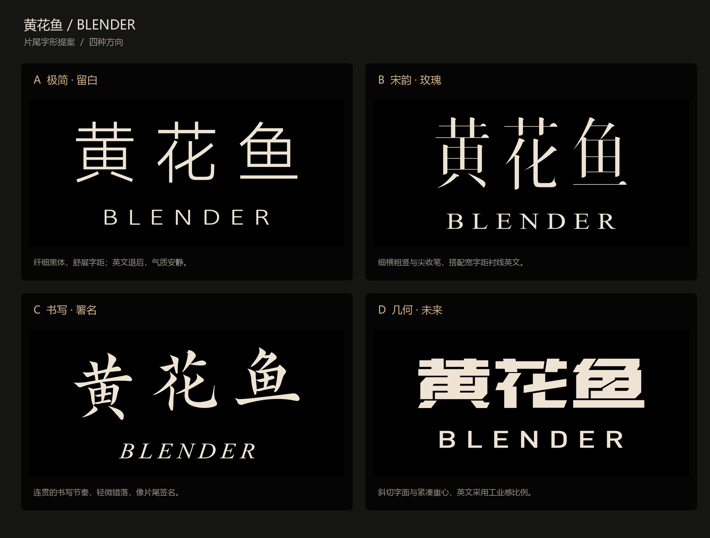
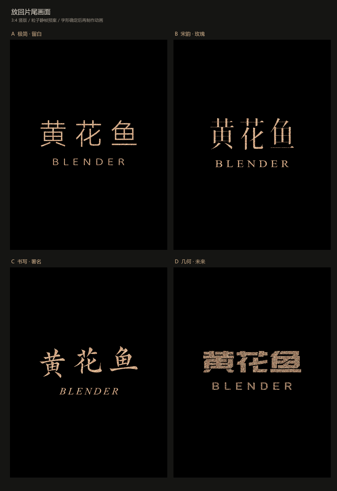

# V9 · 四款字体静帧

用户要求先用画面确认不同字体。这一轮比较极简留白、宋韵玫瑰、书写署名、几何未来四种方向；之后用户提出“艺术化 飘逸 创意一点 重新给10个”。

这是字形选型与粒子静帧预案，没有制作四条新动画，也没有对应的新 `.blend`。公开归档保留原始对比图、[排版参数](styles.json)与[设计说明](设计说明.md)；未发布整套字体软件或本机字体发现脚本。原说明中提到的全部 4K 提案单图不在本目录内，最终选中方案的原生遮罩见 V11 源资料。

[下一轮：十款艺术字](../v010/README.md) · [制作对话](../../conversation.md)
