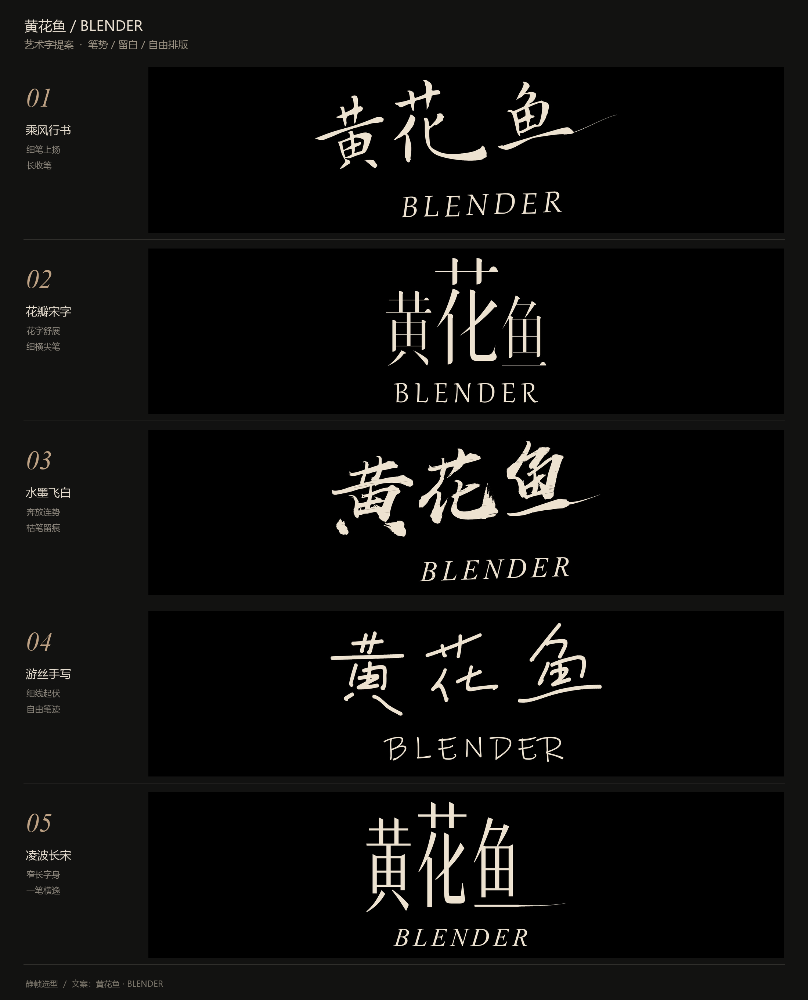
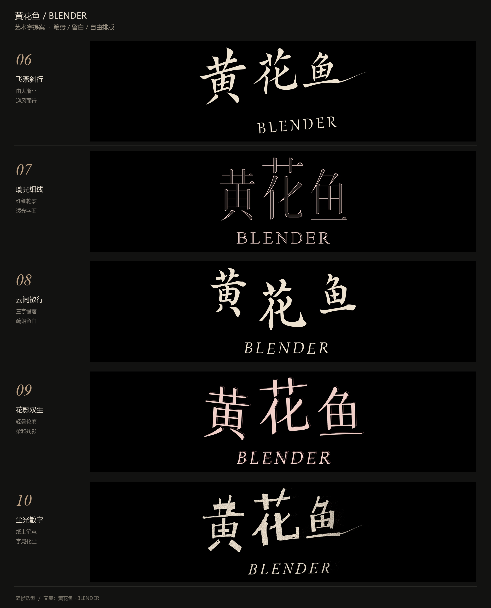
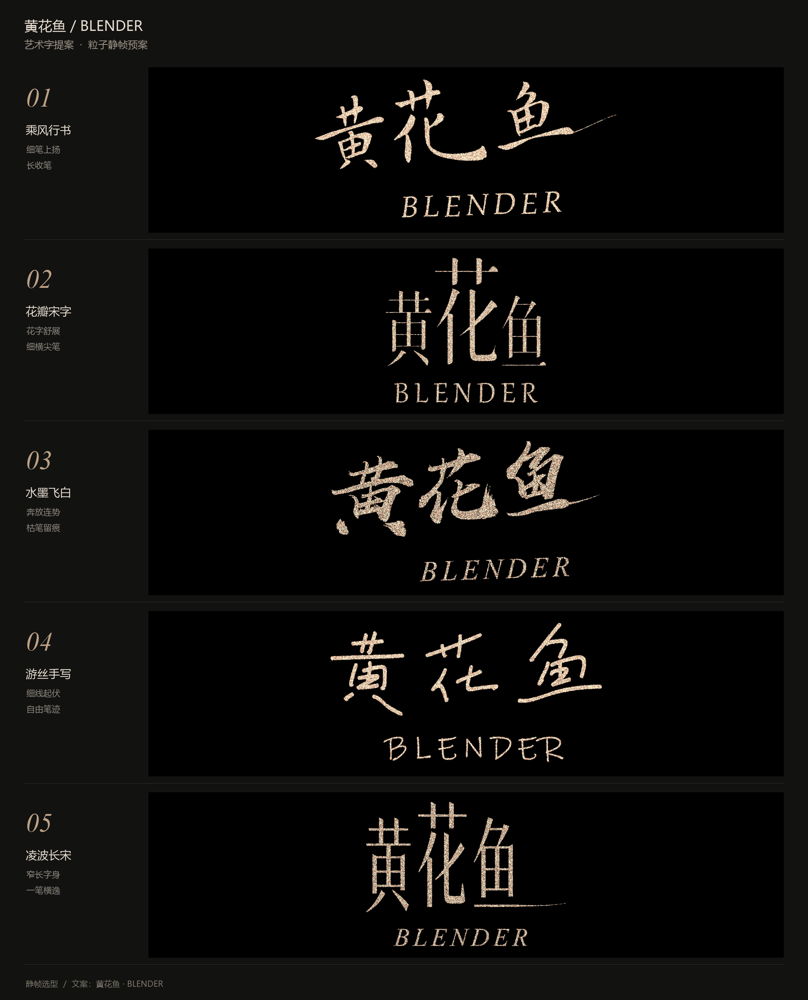
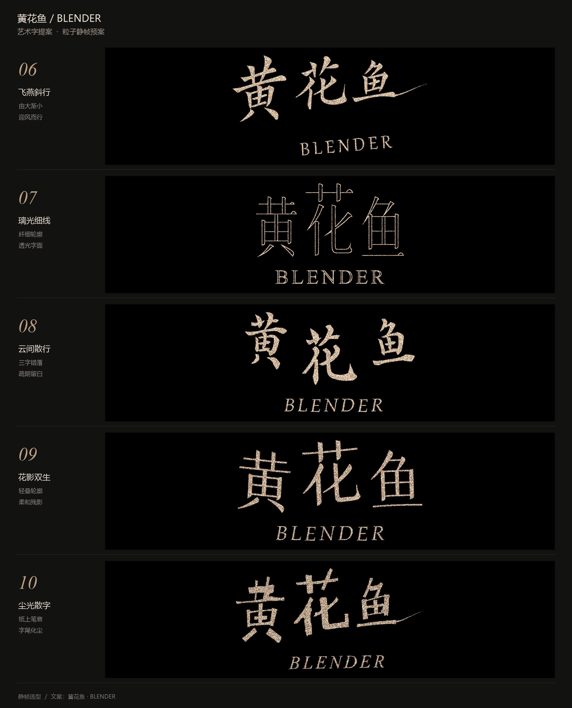

# V10 · 十款艺术字，选中 07「璃光细线」

用户希望更艺术化、飘逸，要求十款新方案。最终发来 07 的截图，并明确说“选的这个”。本轮仍是字形与粒子静帧选型；V11 才将其做成实际 Blender 动画。

归档保留原始对比图、[设计说明](设计说明.md)和[排版参数](styles.json)。全部提案原生单图没有重复加入公开包；选定 07 的[4K 字形图](../../source/source/Approved_07.png)、[轮廓遮罩](../../source/source/07_styled_mask.png)与[采样脚本](../../source/prepare_targets.py)随 V11 完整保留。

[最终工程](../../source/README.md) · [制作对话](../../conversation.md)
