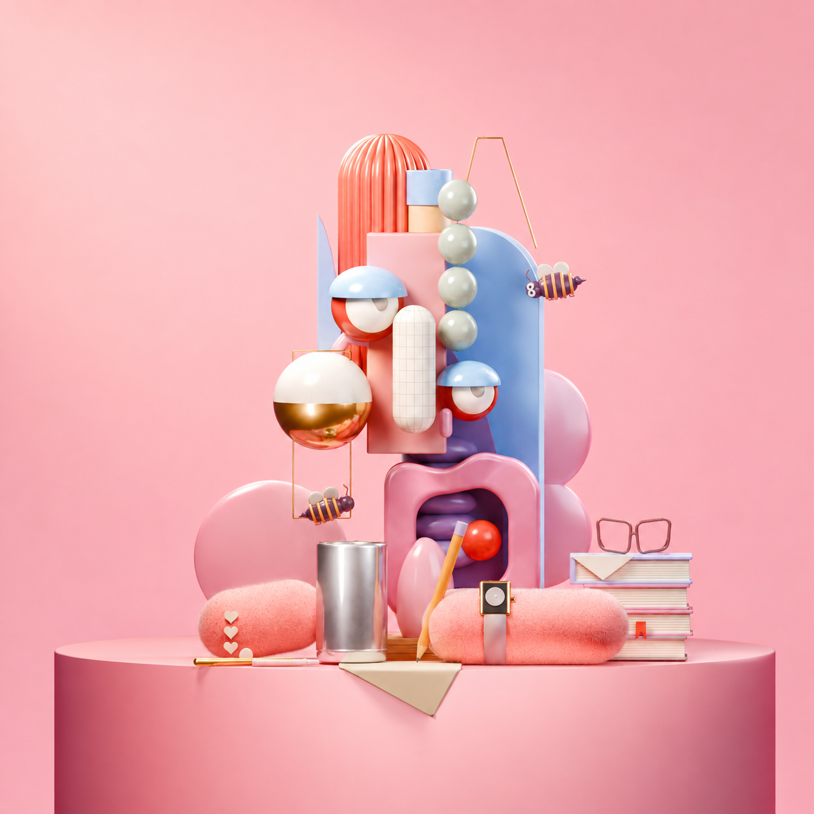

# 粉色装置

早期实践作品，按 2026 年 9 月 6 日资料包整理；用于展示制作过程与源文件，未作为当前 Skill v04 的效能验证。

**可以这样开始：**

> 按参考图做一个粉色玩具装置：珊瑚粉褶柱、蓝色背板、薄荷珠和金白悬球，保留上下堆叠的趣味感。先给我看构图小样，再把陶瓷、金属和短绒做出不同的触感。保存可编辑的 Blender 工程；如果还要做图片精修，请单独给我一份。

这是根据已有制作记录整理的示例提示词，不是当时的原话。[查看完整分轮提示词](prompts.md)

| 制作消耗 | 已有记录 |
| --- | --- |
| Token 用量 | 未记录；历史材料没有可对应到本项目的完整用量数据。 |
| 原生渲染时间 / 显卡 | 4.75 秒，来自 EXR 母版的 RenderTime；原始显卡型号未记录。只覆盖底稿渲染，不含后续图片精修。 |
| 工程中的渲染设置 | Cycles，1080 × 1048，128 samples。这里记录的是底稿设置；上方终图还做过图片精修。 |

[用量与时间的记录范围](../../docs/showcase-measurements.md) · [工程设置检查](../early-works-source-check.md)

从珊瑚粉褶柱、蓝色背板、薄荷珠与金白悬球开始，尝试把一张玩具装置参考转为可编辑的三维场景，再区分陶瓷、金属和短绒的质感。参考原作是 Omar Aqil 的《Casual (Character Illustrations IV)》系列；这里的“粉色装置”是归档用名。[出处与署名](credits.md)

本作经历建模、原生材质与灯光调整、图像精修。上方展示的是最后的精修 PNG；精修加强了粉蓝与香槟金的色彩分离、曲面明暗和细微辉光，也让主体略微放大、顶部留白减少。**这些图片变化没有写回 `.blend`，打开底稿重渲染不会直接得到这张终图。**

可下载 [可编辑底稿](source/editable-base.blend)、[精修前的原生渲染](native-render.png)、[线性 EXR 母版](source/beauty.exr) 和 [展示成品](preview.png)。EXR 是额外后期素材；随包检查记录表明工程没有外部贴图、链接库或缓存依赖。

[制作过程摘要](conversation.md) 保留实际阶段与差异；[六轮优化提示词](prompts.md) 是事后重写的可复用方案；[实际英文精修提示词](postprocess-prompt.txt) 则来自当时的操作记录。生成式精修提示词可用于尝试，结果不保证逐像素相同。

[原生与精修版本对照](version-comparison.jpg) · [实际后期记录](postprocess-record.md) · [历史脚本与初版](../_early-work-support/README.md) · [本次源文件检查](../early-works-source-check.md) · [全部作品](../README.md)
